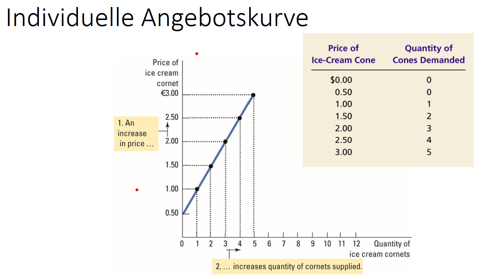
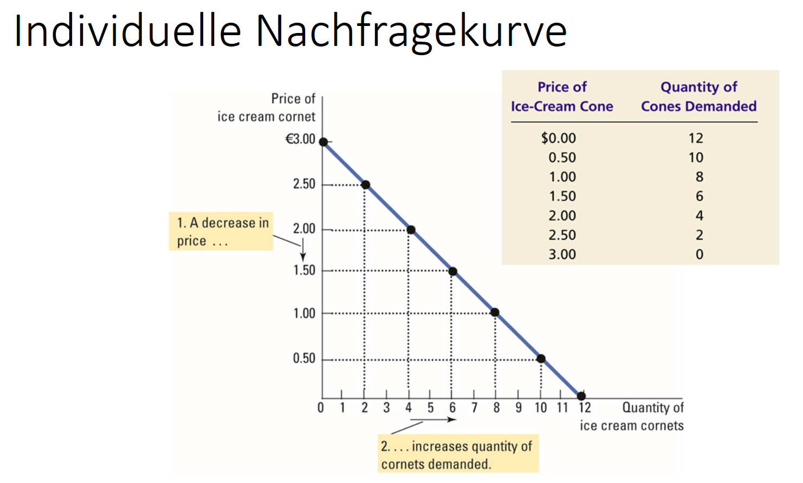

# Definition
Wohlfahrtsökonomik: Teilbereich der volkswirtschaftlichen Forschung,
der mit Nutzen (Wohlfahrt) auf gesamtgesellschaftlicher Ebene
beschäftigt

- Grundlage der Wirtschaftspolitik

# Angebot und Nachfrage

Aggregierte Angebotskurve: Summe aller individuellen
Angebotsmengen für ein Gut (hier Eiscreme) in Abhängigkeit vom
Preis: $S(p)$

Aggregierte Nachfragekurve: Summe aller individuellen Nachfragen
nach einem Gut (hier Eiscreme) in Abhängigkeit vom Preis: $D(p)$

