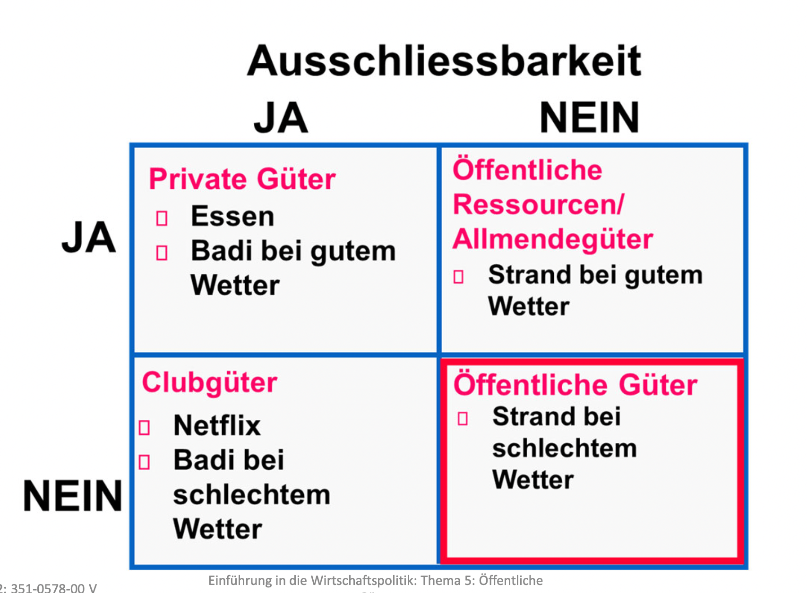

# Gütertypen
## Left scale is Exklusivität

## Nicht-Ausschliessbarkeit

- Ist das entscheidende Kriterium, das ein öffentliches Gut bzw. eine öffentliche Ressource konstituiert.
- Ausschluss kann möglich, aber (zu) kostspielig oder politisch unerwünscht sein.

# Öffentliche Güter
[Vgl positive Externalitäten Thema 4](ETH.EWP.Externe_Effekte.md)

## Trittbrettfahrer‐Problem und Marktversagen
- Personen können Öffentliche Güter konsumieren, ohne etwas dafür zu bezahlen ("Trittbrettfahrer‐Problem")
- Private Anbieter produzieren diese Güter nicht in sozial optimaler Menge, da ihre Kosten nicht über Preis gedeckt werden
- Allokationsfolgen: Ineffizient niedrige Versorgung mit öffentlichen Güter
- **Marktversagen**

## Wichtige Öffentliche Güter
- Landesverteidigung
- Grundlagenforschung
-  Armutsbekämpfung?!

# Öffentliche Ressourcen
## Trittbrettfahrer‐Problem und Marktversagen
- Konsumenten können öffentliche Ressourcen konsumieren, ohne etwas dafür zu bezahlen.
- Allokationsfolgen: Ineffizient hohe Nutzung der öffentlichen Ressourcen («Tragedy of the Commons»)
- **Marktversagen**

## Wichtige Öffentliche Ressourcen
- Saubere Luft und frisches Wasser
- Fisch und Wild
- Strassen

# Staatseingriff
- Ineffizient niedrige Bereitstellung von öffentlichen Gütern bzw. ineffizient hohe Nutzung der öffentlichen Ressourcen konstituiert Marktversagen.
- Korrektur des Marktversagens: Angebot des öffentliches Gutes/der öffentliche Ressource durch Staat
- **Fragen dazu**:
    - Welche Menge soll der Staat anbieten?
    - Wie soll der Staat die Mittel dafür aufbringen?

Beide Aspekte können in einem Referendum miteinander verknüpft werden.
Wohlfahrtsmaximierung aus ökonomischer Perspektive: Die Menge des öffentlichen Gutes sollte so lange ausgedehnt werden, bis die vertikale Summe der Grenznutzen (=Zahlungsbereitschaften) aus dem öffentlichen Gut gerade gleich den Grenzkosten für die letzte bereitgestellte Einheit ist.

# Was macht ein öffentliches Gut/eine öffentliche Ressource zu einem öffentlichen Gut/einer öffentlichen Ressource?
- Ob ein öffentliches Gut/eine öffentliche Ressource ein öffentliches Gut/eine öffentliche Ressource ist, hängt oft von politischen Präferenzen bzw. von spezifischen natürlichen/technischen Umständen ab.

## Politische Präferenzen
- Strände sind in vielen Ländern öffentliche Ressourcen. Nicht‐ Ausschliessbarkeit ist gesetzlich statuiert. Strände könnten auch privatisiert werden. Der Besitzer würde den Zugang bzw. die Benutzung kontrollieren.
- Gleiches bei Autobahnen
- Viele Länder garantieren den allgemeinen Zugang zu einem Mindestmass an Gesundheitsdienstleistungen.
-> Gesundheitsdienstleistungen als öffentliche Ressource

## Natürliche Umstände
- Leuchturm
    - Fall A: Leuchtturm dient vielen Schiffen als Orientierung -> Leuchtturm als öffentliches Gut.
    - Fall B: Leuchtturm wird nur von Schiffen gebraucht, die einen bestimmten Hafen ansteuern.

## Technische Umstände
- Technischer Fortschritt bzw. staatliche Regulierungen können zu einem Wechsel der Eigenschaft privates Gut/öffentliches Gut führen.
- Beispiel Musik:
    - Wandlung von öffentlichem Gut in privates Gut mit Aufkommen von Urheberrechtsschutz (Schweizer Genossen‐ schaft der Urheber und Verleger von Musik (SUISA)).
    - Wandlung von privatem Gut zu öffentlichen Gut durch leichte Kopierbarkeit im Internetzeitalter (P2P).
