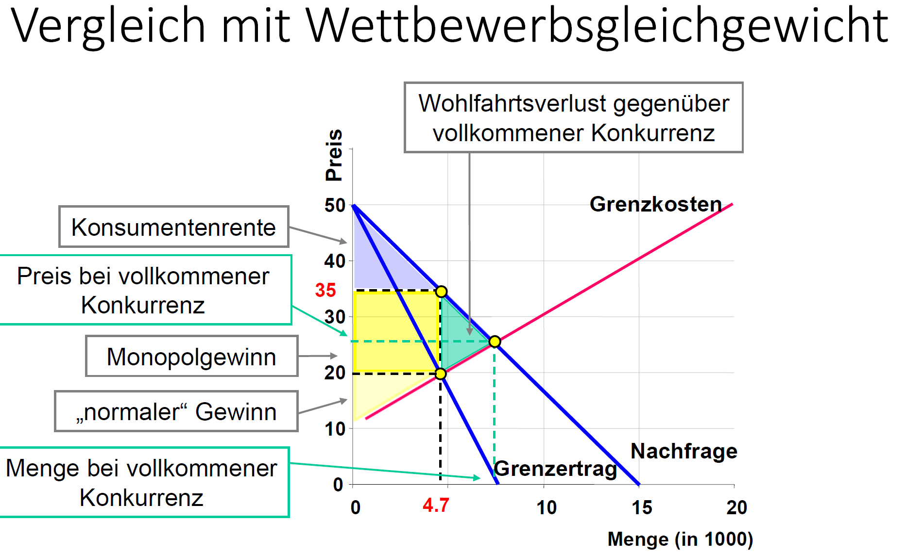

# Wettbewerb
# Warum Wettbewerb?
- Wettbewerb ist notwendige Voraussetzung für das Erreichen einer pareto‐effizienten Allokation
- In einem Wettbewerbsmarktgleichgewicht ist die Wohlfahrt (=Summe aus Produzenten‐ und Konsumentenrente) bei Voraussetzung einer utilitaristischen sozialen Wohlfahrtsfunktion maximiert
(siehe [[Thema 2|ETH.EWP.Wettbewerb_Effizienz]])

- «Innovationsfunktion» des Wettbewerbs
- «Informationsfunktion» des Wettbewerbs:  
Dank der dezentralen Koordination passt sich die Wirtschaft flexibel an neue Ereignisse, Produkte und Technologien an. Der Marktmechanismen führt bei einer Änderung der «Anfangsausstattung» zu einem neuen pareto‐optimalen Gleichgewicht.
- «Beschränkungsfunktion» des Wettbewerb:  
Einschränkung privater (Wirtschafts-)Macht. Die Marktakteure müssen sich nach den Präferenzen der anderen Marktakteure,
wenn sie am Markt bestehen wollen

# Monopol
## Gewinnmaximierung
$$
max_x \Pi = p(x)x -C(x) \\
\frac{\partial \Pi}{\partial x} = \frac{\partial [p(x)x]}{\partial x} - \frac{\partial C(x)}{\partial x} = 0 \\
\frac{\partial [p(x)x]}{\partial x} = \frac{\partial C(x)}{\partial x}\\
\text{Grenzertrag = Grenzkosten}
$$
Es gilt: Solange die letzte produzierte Einheit den Umsatz um mehr als ihre Kosten
erhöht, lohnt es sich, sie zu produzieren
Im Vergleich: Bei vollkommenem Wettbewerb gilt Grenzertrag = Marktpreis

Monopolist kann den Preis durch Variation der Angebotsmenge
beeinflussen. Er zieht die Preis‐Absatz‐Funktion (= Nachfragefunktion) ins Kalkül
mit ein

Bei einer linearen Nachfragefunktion d.h. $p(x) = a - bx$
ergibt sich:
$$
p(x)x = (a - bx)x = ax -bx^2\\
$$
Grenzertrag:
$$
\frac{\partial [p(x)x]}{\partial x} = a - 2bx
$$

### Grafisch
 

> Wenn eine Einheit mehr als 4700 produziert wird, erhöhen sich die Kosten mehr als der
> Umsatz, weil für alle Einheiten bis zur 4700ten Einheit der Preis unter 35 gesenkt
> werden muss. (Der Monopolist kann nicht Preis und Menge gleichzeitig diktieren,
> sondern nur eins von beiden.) Deshalb wird der Gewinnblock kleiner als im sog.
> Cournot‐Punkt. Der Verlust an der Oberseite des dunkelgelben Quadrats ist ab dem
> Cournotpunkt grösser als der Zugewinn an dessen rechter Seite, m.a.W., der Effekt der
> Preissenkung auf den Gewinn ist stärker als der Effekt des Umsatzzuwachses. Vor der
> 4700ten Einheit ist es andersherum.
> Hinweis: Der Verlust an der Oberseite des dunkelgelben Quadrats minus dem Zugewinn
> an dessen rechter Seite entspricht dem Umsatzzuwachs minus dem Kostenzuwachs. 4.7/35: Cournot‐Punkt*

## Wirtschaftspolitische Handlungsempfehlung für Monopolfall

Im Monopolgleichgewicht wird gemäss dem utilitaristischen
Wohlfahrtsprinzip die gesamtgesellschaftliche Wohlfahrt (= Summe
aller Renten) nicht maximiert.
**Handlungsempfehlung** bei Voraussetzung des utilitaristischen
Nutzenprinzips: Auflösung des Monopols und Ersetzung durch Markt
mit vollkommenem Wettbewerb.

# Oligopolmarkt

Oligopolmarkt: Wenige Anbieter verkaufen ein gleiches Produkt.
- In der Realität verbreitete Zwischenform zwischen vollkommenem
Wettbewerbsmarkt und Monopol

Oligopson: Wenige Nachfrager, viele Anbieter (Nachfrageoligopol)

## Strategische Interaktion
- Die Interdependenz zwischen Aktionen der einzelnen Anbieter ist von zentraler Bedeutung dafür, welches Marktgleichgewicht sich einstellt?
- Jeder Anbieter muss bei seinen Entscheidungen die Reaktionen der anderen Anbieter voraussehen («strategisches Verhalten»).
- Wie reagieren die Konkurrenten auf eine eigene Preisänderung bzw. eine eigene Mengenänderung?
- (Wie reagieren die Konkurrenten auf eine Werbekampagne?, …)

-> Analyse der Hilfe der Spieltheorie

## Gleichgewicht
Wenn die Anbieter im (nicht‐kartellierten) Duopolmarkt ihre
gewinnmaximierenden Mengen wählen, wird
- das Angebot grösser als im Monopol, aber kleiner als im vollkommenen Wettbewerb.
- der Marktpreis tiefer als im Monopol, aber höher als im vollkommenen Wettbewerb.

## Wirtschaftspolitische Handlungsempfehlung für Oligopolfall
Implikation des Cournot Duopolmarktmodells: Gemäss dem
utilitaristischen Wohlfahrtsprinzip ist die gesamtgesellschaftliche
Wohlfahrt (= Summe aller Renten) bei Oligopol nicht maximiert.
-> Handlungsempfehlung bei Voraussetzung des utilitaristischen
Nutzenprinzips: Auflösung der Oligopolstruktur und Ersetzung durch
Markt mit vollkommenem Wettbewerb.

**Vorsicht:**
Die Resultate das Vollkommene Wettbewerbsmärkte Oligopolen immer zu bevorzugen sind beruhen auf evtl.
nicht sinnvollen annahmen (vgl. [[Thema 2 |ETH.EWP.Thema_2#gültigkeit-der-marginalbedingungen]]).
Oligopole können vorteile durch 'Economy of scale haben'

# (Nicht‐)Stabilität von Wettbewerbsmärkten
- Wettbewerb schlecht für Unternehmen, da er gewinne beschränkt 
    - **Auf vollkommenen Wettbewerbsmärkten ist der Gewinn langfristig gleich Null!**
- Wettbewerb bedeutet für Unternehmen Unsicherheit und bedroht evtl. ihre existens 
-> Es gibt ein Anreiz Wettbewerb abzuschaffen

## Wettbewerbsbehörden
- Hypothese: Wettbewerbsmärkte tendieren natürlicherweise dazu, von Wirtschaftsakteuren abgeschafft bzw. zumindest beschränkt zu werden.
- Wohlfahrtseinbusse gemäss utilitaristischem Nutzenprinzip (Summe aller Renten im Wettbewerbsmarkt < Summe aller Renten im Monopol/Oligopol)
- Zentrales Argument für Existenz von Wettbewerbsbehörde: staatliche Überwachung der Einhaltung wettbewerblicher Prinzipien

Ordoliberalismus: Wichtige Aufgabe des Staates ist es, die Wettbewerbsordnung zu 'hegen und pflegen'

### In der Schweiz
Wettbewerbskommission “Weko”
- [www.weko.admin.ch](www.weko.admin.ch)
- 1996 als Nachfolgerin der sog. Kartellkommission gegründet
- Sitz in Bern
- Dem Eidg. Departement für Wirtschaft, Bildung und Forschung zugeordnet, aber **entscheidungs‐ und weisungsunabhängig**
Trotzdem Politischerdruck (vgl. [NZZ Artikel](slides/Thema3_NZZArtikel_04-03-2022_Bussenf%C3%BCrBaukartellehabeneinpolitischesNachspiel.pdf))

# Private Wettbewerbsbeschränkungen
- Unternehmenskonzentration
- Abgestimmtes Verhalten ('Kartelle')
- Missbräuchliche Ausnutzung von Marktmacht
    - 'Ausbeutungsmissbrauch'
    - 'Behinderungsmissbrauch'

## Unternehmenskonzentration
siehe Mono-/Oligopol

### Herfindahl‐Hirschman Index zur Messung von Unternehmenskonzentration
$$
HHI = \sum_{i=1}^{N}(\frac{x_i}{\sum_{j=1}^{N} x_j })^2
$$
Dies gibt den Markenteil in Prozent im Quadrat (das Quadrieren stärkt die Empfindlichkeit der Funktion auf grosse Unternehmen)
$$
\frac{1000}{N} \leq HHI \leq 1000
$$
Monopol: HHI = 10000
Gleich grosse Duopolisten: HHI = 5000.
Unterschiedlich grosse Duopolisten: HHI = 90^2+10^2 = 8200

In den USA wird der HHI-wert zur Fusionskontrolle verwendet:
- Fusion unproblematisch, wenn Post‐Fusions‐HHI ≤ 1000.
- Märkte mit HHI zwischen 1000 und 1800 gelten als «moderately concentrated».
- Fusion problematisch, wenn der Post‐Fusions‐HHI > 1800 und $\delta HHI$ > 100.

## Kartelle
- Vertragliche Vereinbarung zwischen rechtlich selbständigen Unternehmen, sich keine Konkurrenz zu machen.
- Unternehmen verhalten sich gemeinsam wie ein Monopol, wodurch der gemeinsame Gewinn maximiert wird.
-> Im Vergleich zum Wettbewerbsfall höhere Preise, niedrigere Angebotsmengen, höhere Gewinne, aber eine niedrigere Gesamtrente (vgl. Monopol).

Potentielle Instabilität von Kartellen
- Aus Perspektive eines (jeden) Kartellmitglieds kann es sich lohnen, einen niedrigeren Preis als die anderen Kartellmitglieder anzubieten, um Marktanteile zu gewinnen.
- Potentielle Instabilität des Kartells

## Missbräuchliche Ausnützung von Marktmacht
### Behinderungsmissbrauch
« liegt dann vor, wenn durch ein marktmächtiges Unternehmen Markteilnehmer derselben oder der
anderen Marktseite zu einem bestimmten Verhalten genötigt werden oder potentielle Wettbewerber vom Markteintritt abgehalten werden.
- Ausschliesslichkeitsvereinbarungen («Du kaufst nur bei mir!»)
- Kopplungsgeschäfte («Du kaufst, was du willst – und noch etwas anderes dazu!»)
- Vertriebsbindungen («Du darfst nicht an jeden weiterverkaufen.»)
- Liefersperren (Boykott)

### Ausbeutungsmissbrauch
meint die Durchsetzung "zu hoher" Preise (verglichen mit dem Wettbewerbsfall) oder das Bezahlen "zu
tiefer" Preise durch marktmächtige Nachfrager (z.B. Automobilkonzern gegenüber kleinen Zulieferern) bezeichnet, wie es für
monopolistische Marktformen (inkl. Oligopole, Kartelle) typisch ist.
**Problem**: Ausbeutungsmissbrauch lässt sich zwar im theoretischen
Modell schön ableiten, in der Praxis aber kaum beweisen, da man den
Wettbewerbspreis (in Ermangelung von Wettbewerb) nicht kennt.

# [Kontrollfragen](slides/Thema3_Wettbewerbspolitik.pdf)