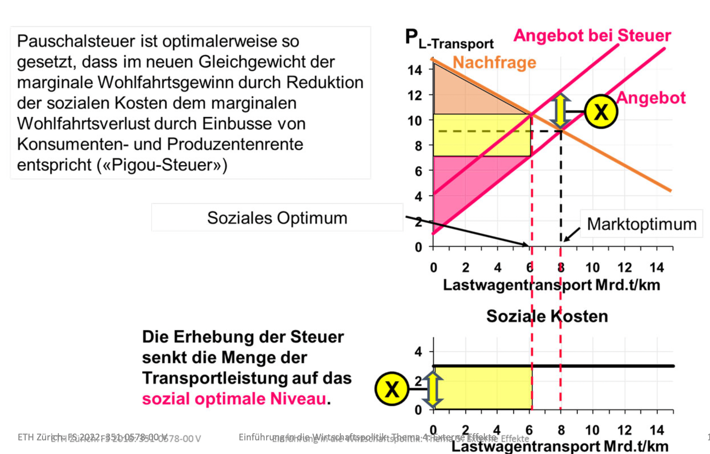

# **1. Hauptsatz der Wohlfahrtsökonimik**

Jedes allgemeine Wettbewerbsgleichgewicht ist unter bestimmten Voraussetzungen pareto‐effizient.

Gilt nur unter gewissen Voraussetzungen:

- Keine Externalitäten
- Vollständige Information
- Keine Grössenvorteile
- ...

# **Definition Externalität**

Eine Externalität ist eine Auswirkung der ökonomischen Entscheidung eines Akteurs auf die Wohlfahrt eines oder mehrerer anderer Akteure, welche der Akteur in das seiner Entscheidung zugrundeliegende Optimierungskalkül nicht mit einbezieht.

## Positive Externalität

Positive Wohlfahrtsauswirkung, die der Akteur für die Optimierung seiner Entscheidung nicht berücksichtigt.

Jemand erhält etwas ohne dafür bezahlen zu müssen.

## Negative Externalität

Negative Wohlfahrtsauswirkung, die der Akteur für
die Optimierung seiner Entscheidung nicht berücksichtigt.

Jemandem wird geschadet ohne dafür eine Kompensation zu erhalten.

# Grafische Analyse

# Beispiele

## Umweltverschmutzung

- Industriegüter produzenten beachten bei Produktion nicht, dass Ihr Ausstoss von Umweltgiften die Wohlfahrt der Bürger negativ beeinträchtigt.
- CO2 Ausstoss ist eine negative externalität der heutigen Generation auf zukünftige Generationen.

## Rando Fact

Schweizer Autofahrer beachten bei der Wahl ihrer gefahrenen Kilometer bzw. bei der Wahl des Verschmutzungsgrads ihres Autos nicht die negativen Effekte auf Umwelt und Mitmenschen.

5.6 Milliarden CHF im Bereich privater motorisierter Personenverkehr wurden von der Allgemeinheit getragen und sind daher externe Kosten. (Zum Vergleich: BIP Schweiz 2016: ca. 635 Milliarden CHF.)

# Staatsbudget

- Einnahme- und Ausgabeprozesse sind getrennt
- Ausgaben für spezifische Interessensgruppen sind von allen getragen
- Interessensgruppen fakturieren den Nutzen von ihnen zugute kommenden Ausgaben voll, die Kosten der Ausgaben (höhere Steuern) aber nur teilweise, da diese von allen Steuerzahlern getragen werden müssen

-> Führt zu ineffizient hohem Staatsbudget

- Achtung: Unter geänderten Grundannahmen lässt sich auch dafür argumentieren, dass sich aufgrund externer Effekte ein ineffizient niedriges Staatsbudget einstellt!

- Negative Externalitäten sind omnipräsent
- Passiv rauchen, Lärmemissionen, z.b. durch Partygägner

# Algebraische Analyse

Erwartete Bruttowohlfahrt aus Ausgaben für Forschung und Entwicklung von Unternehmen $i$:

$$
E[W] = prob_s(C(x_i))W_s + prob_i(C(x_i))W_i - C(x_i)
$$

$x_i$: von Unternehmen $i$ zu wählender Faktorinput in F&E/R&D. 
$C$: Kosten für F&E/R&D in abhängigkeit von $x_i$. 
$prob_i$: Wahrscheinlichkeit, dass Ausgaben $C()$ zu einen neuen Produkt und damit zu Einahmen $W_i$ für Unternehmen $i$ führen. 
$prob_s$: Wahrscheinlichkeit, dass Ausgaben $C()$ zu einen neuen Produkt und damit zu Nutzen $W_s$ für die Allgemeinheit bzw. für andere Unternehmen führen (Technologie-Spillover).

# Optimierungskalkül

Optimierungskalkül von Unternehmen $i$:

$$
\underset{x_i}{max} prob_i(C(x_i)) W_i - C(x_i)
$$

$$
\frac{d[prob_i()W_i]}{dx_i} = \frac{dC(x_i)}{dx_i}
$$

Optimierungskalkül eines sozialen Planers (gesamtgesellschaftliches Optimierungskalkül):

$$
\underset{x_i}{max} prob_s(C(x_i)) W_s + prob_i(C(x_i)) - C(x_i)
$$

$$
\frac{d[prob_s()W_s+prob_i()W_i]}{dx_i} = \frac{dC(x_i)}{dx_i}
$$

## Unterinvestition in F&E

Passiert wenn:

$$
\frac{d[prob_s(C(x_i))W_s]}{dx_i} > 0
$$

Optimaler Faktorinput aus Sicht des Unternehmens ist kleiner als der aus Sicht der Gesamtgesellschaft. Heisst, aus gesamtgesellschaftlicher Sicht wird zu wenig in F&E investiert!

# Positive Externalitäten: Beispiele

## F&E, Bildung und Gesundheit

- Investition in Bildung durch Individium kann profit für gesamte Gesellschaft generieren. Höhere Produktivität des Individuums erhöht auch die Produktivität andeere Gesellschaftsmitglieder. Jedoch beachtten die Individuen, dies nicht hinreichend bei ihren Bildungsentscheiden.
- Gesamtgesellschaft profitiert von gesundem Lebensstil des Individuums, durch Reduktion der Gesundheitskosten.
  **Annahme**: Krankenversicherung ist wenigstens zum Teil staatlich bzw. durch die Allgemeinheit finanziert.

## Infrastrukturinvestitionen und Netzwerke

- Ein (privater) potentieller Flughafeninvestor beachtet bei seinem Investitionskalkül nicht hinreichend, dass vom besseren Verkehrsanschluss auch die lokale Wirtschaft profitiert.
- Wenn Individuum A zu Smartphoneanbieter X wechselt, profitieren auch allen anderen Individuen, die bereits bei X sind und potentiell mit A kommunizieren, davon (niedrigere Kommunikationsgebühren im gleich Netz). Diesen Nutzen der anderen beachtet A bei seiner Netzwahl u. U. nicht hinreichend (sog. Netzwerktexternalität).
- ** Auch positive Externalitäten sind omnipräsent **

# Externe Effekte, Marktversagen und Rolle des Staates

## Erster Hauptsatz wird ausser Kraft gesetzt

- Private Nutzenmaximierung im Rahmen von Wettbewerbsmärkten führt nicht zum gesellschaftlichen Pareto‐Effizienz‐Optimum.
- Die Renten werden nicht maximiert.
- Verletzung des Prinzips der „unsichtbaren Hand“
- Die durch die marktmässige Koordination erreichte Allokation ist pareto‐ineffizient.
- «Zu hohe(r)» Produktion (Konsum) von Gütern mit negativen Externalitäten
- «Zu niedrige(r)» Produktion (Konsum) von Gütern mit positiven Externalitäten

## Rolle des Staates

Bei Externalitäten, muss ein zentraler Planer (=der Staat) eingreifen, um eine "Internalisierung" der Externalitäten zu bewirken. Dies bringt die Allokation (Gesamtsituation?) näher an das gesellschaftliche Wohlfahrtsmaximum (sog. Allokationspolitik).

## Direkte Staatseingriffe
- Verbote bzw. direkte Auflagen bei negativer Externalität
    - z. B. Grenzwerte für CO2‐Emmission: Staat legt fest, wie viel Schadstoffe ausgestossen werden dürfen.
    - Oft einfachster Weg negative Externalitäten zu beschränken
- Staatliche Bereitstellung bei positiver Externalität
    - z.B. staatliche Bereitstellung Gesundheit, Bildung, Infrastruktur
    - z.B. staatliche F&E‐Tätigkeit
- Fusion der Verursacher mit den Geschädigten oder Begünstigten
    - z.B. negative externe Effekte: Papierfabrik und Fischereibetrieb
    - z.B. positive externe Effekte: Imker mit Fruchtbaumplantage

# Coase-Theorem
## Definition
Privatakteure können Externalitätsprobleme selbst lösen. Ausgehend von einer anfänglichen Verteilung von Rechten können die Akteure über Verhandlungen einen pareto‐effizienten Zustand erreichen (in dem alle besser gestellt sind als in der Ausgangssituation).

**Beispiel:** Raucher und Nichtraucher im Büro verhandeln untereinander über die optimale Menge an Rauchausstoss. Nach Verhandlung sind alle besser bzw. zumindest nicht schlechter gestellt.

** Achtung: ** Das sich aus den Verhandlungen ergebende Pareto‐Optimum hängt von der Rechteverteilung in der Ausgangssituation ab.
- Ausgangssituation 1: Raucher hat das Recht, im Büro zu rauchen. Beide Individuen können sich u. U. besser stellen, indem der Nichtraucher den Raucher für eine Reduktion des Zigarettenkonsums bezahlt.
- Ausgangssituation 2: Raucher hat nicht das Recht, im Büro zu rauchen. Beide Individuen können sich u. U. besser stellen, indem der Raucher den Nichtraucher für sein Recht zum Rauchausstoss bezahlt.

## Vorraussetzungen
- **Vollkommene Information:** Wahre Präferenzen müssen bekannt sein.
- **Irrelevanz von Transaktionskosten:** V. a. bei vielen Verhandlungspartnern kann das Finden einer Verhandlungslösung sehr teuer werden.

In der Praxis sind diese oft nicht gegeben

# Elinor Ostrom: Governing the Commons
- Analyse des Umgangs mit Allmenderessourcen (z. B. Hochgebirgs‐ almen in der Schweiz)
- Problem der ineffizient hohen Nutzung aufgrund negativer externer Effekte

** Solutions:**
- Verhinderung von Übernutzung durch institutionalisierte lokale Kooperationen der Benutzer
- Staatliche Lösung ist ebenso wenig nötig, wie Lösung über staatlich garantierte Zuteilung von Eigentumsrechten.

# [Exkurs Emissionshandel in Europa Slide 38-46](slides/Thema4_ExterneEffekte.pdf)
