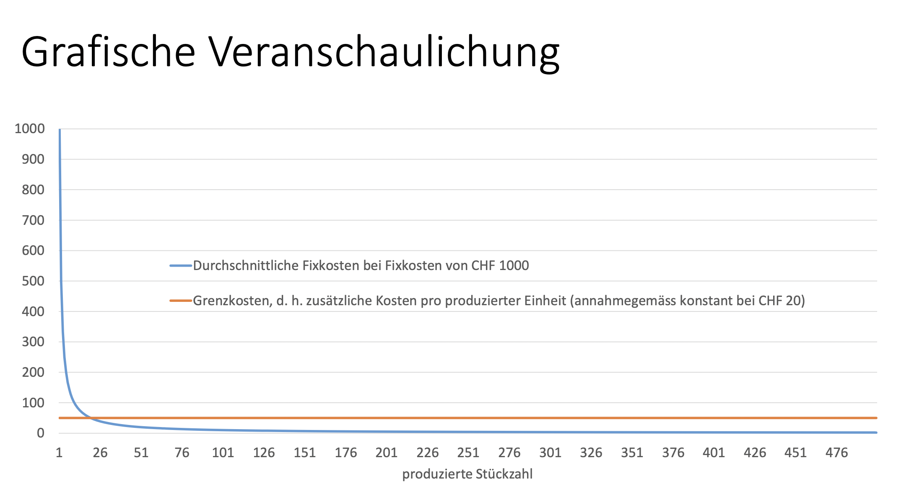
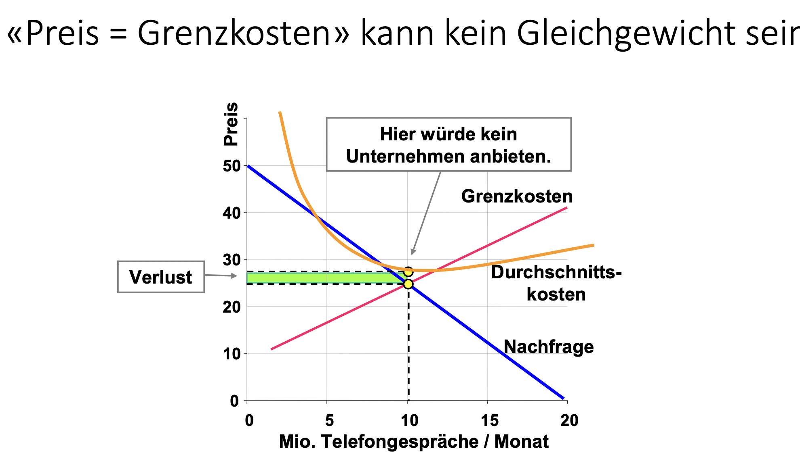
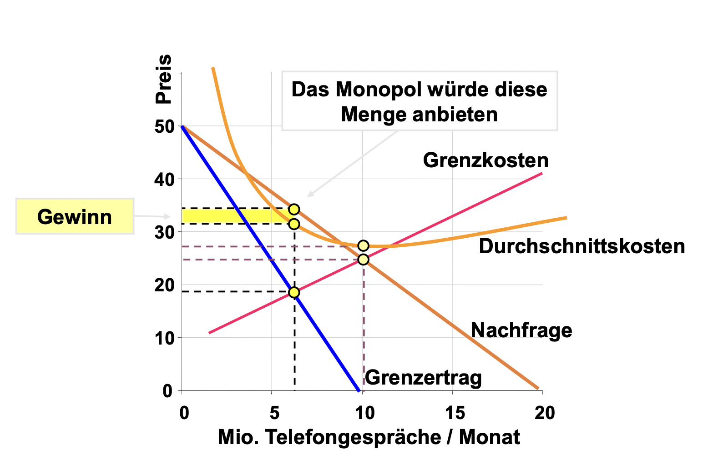
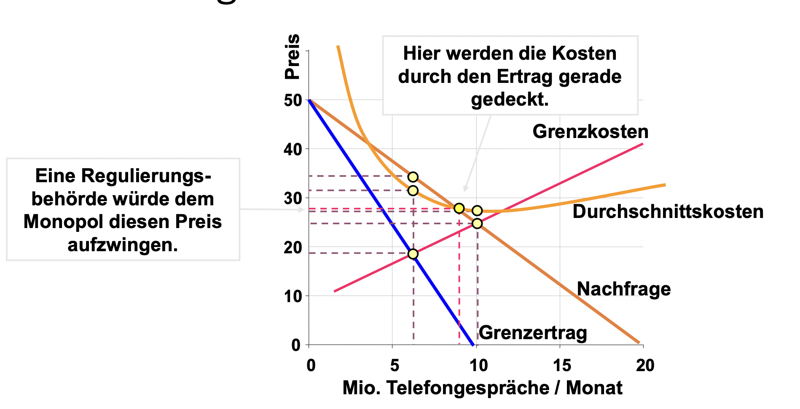

<!-- TODO: Add link -->
[Rekapitulation Erster Hauptsatz Wohlfahrtsökonomie](ETH.EWP.Thema_2.md)

# Tendenz zu Monopolisierung
- Unternehmen zielen "natürlicherweise" auf eine Monopolstellung ab, da dies ihre Gewinne steigert. 
    - Produktdifferenzierung 
    - Innovation
    - Preisabsprachen, Kartellbildung bzw. Fusionen
    - Verdrängung von Konkurrenten

**Achtung:** Sollte man die Tendenz von Unternehmen Wettbewerbsmärkte abzuschaffen bereits als «Marktversagen» bezeichnen? Nicht gemäss der hier eingeführten Konzeption von Marktversagen. In jedem Fall handelt es sich aber um eine grosse Herausforderung für die (Wirtschafts‐)politik (vgl. Thema Wettbewerbspolitik).

#  Subadditive Kostenfunktion
$$
C(y_1) + \dots + C(y_n) > C(y_1 + \dots + y_n)
$$
## Definition: Markt mit natürlicher Monopol-Struktur
Monopolmarkt, welcher daraus entsteht, dass ein einzelnes Unternehmen die am Markt absetzbare Gesamtmenge zu geringeren Kosten produzieren bzw. anbieten kann als zwei oder mehrere Unternehmen.

Subadditive Kostenfunktion liegt meist vor, wenn die Produktion mit hohen Fixkosten und niedrigen Grenzkosten verbunden ist.

Bei Vorliegen einer subaditiven Kostenfunktion ist eine Wettbewerbsmarktgewichtslösung:
- in der Regel nicht erreichbar: Durchschnittskosten > Grenzkosten
- nicth pareto effizient bzw. nicht wohlfahrtsoptimiert

# Sunk Costs
## Definition
Irreversible Kosten. Vergangene Kosten, die nicht mehr Rückgängig gemacht werden können, wenn sie einmal aufgewendet wurden.

-> **Sunk costs haben – wenn Sie einmal aufgewendet wurden – keinen Einfluss auf die Entscheidungsfindung des Unternehmens mehr.**

# Stabilität von natürlichen Monopolmärkten
- Anbieter kann Markteintritt von Konkurrenten verhindern
    - Er hat seine Fixkosten bereits aufgewendet. Seine Fixkosten sind damit sunk costs.
    - Er kann Preis = Grenzkosten setzen, ohne Verluste zu erleiden.
- Potentieller Konkurrent wird nur in den Markt eintreten, wenn Preis zumindest seine Durchschnittskosten (Grenzkosten plus Anlaufkosten) deckt.
- «Preis = Grenzkosten»‐Drohung hält Konkurrenten vom Markteintritt ab

# Beispiele von Bereichen mit hohen Sunk Costs
##  «Netz»‐Märkte
- Übertragungsnetzwerk für Strom
- Telefonnetz für Fixtelefonie
- Schienennetz für Zug

##  Natürliche Monopole auf Clubgütermärkten
Sind nicht selten natürliche Monopolmärkte
- Oft hohe Fixkosten
- Kosten einer zusätzlichen konsumierten Einheit (= Grenzkosten) oft sehr niedrig (keine Rivalität im Konsum)
- Subadditive Kostenfunktion

#  Natürliche Monopole und Wohlfahrt
- Natürliches Monopol wird Monopolpreis setzen, sofern die Markteintrittsdrohung eines potentiellen Wettbewerbs nicht permanent ist.
<!-- TODO: Add link -->
- Aus Wohlfahrtsperspektive suboptimales Marktgleichgewicht [vgl. Thema 3]()

# Monopollösung

# Rolle des Staates
Zur Wohlfahrtssteigerung sollte der Staat den Marktpreis regulieren oder die Güter natürlicher Monopole selbst anbieten!

##  Preisregulierung
- Option 1: Kostenorientierte Preisregulierung: Der Preis wird regulatorisch auf das effiziente Kostenniveau festgelegt.
- Lösung «Preis = Grenzkosten»: Bei natürlichen Monopolen nicht kostendeckend.
- Lösung «Preis = Durchschnittskosten»

## Probleme mit Preisregulierung
- Zurechnung von Fixkosten (zur Ermittlung der Durchschnittskosten) ist problematisch.
- Anreize zu Kostensenkungen sind für das Monopol äusserst gering, ebenso für Produktinnovationen (Folge: dynamische Ineffizienz).
- Informationsprobleme: Woher erfährt die Regulierungsbehörde die tatsächlichen Kosten? Der Monopolist hat Anreize, die Kosten falsch darzustellen, zudem ist der bürokratische Aufwand (Kostennachweise) sehr hoch.

## Gewinnregulierung
Idee: Nicht die Preise werden reguliert, sondern die Monopolgewinne (bzw. die Kapitalrenditen) werden regulatorisch beschränkt und damit indirekt auch die Preise.
-> **Traditionelle Regulierungsart, die in den USA vielfach verwendet wird („Rate‐of‐return“‐Regulation).**

##  Probleme bei Gewinnregulierung
- Anreize für Kostensenkung und Produktinnovationen sind gering (da Gewinn festgelegt ist).
- Die «richtige» Rendite zu finden, ist schwer.
    - zu niedrig: Investitionsanreize schwinden (Gefahr
    von «blackouts» etc.).
    - zu hoch: es wird über Investiert («Averch‐Johnson‐ Effekt»)
    
**In beiden Fällen kommt es zu Fehlallokation von Kapital (und Arbeti)**

##  «Price Cap»‐Regulierung
Anreizorientierte Regulierung der Preisveränderungen
- Idee: Dem Monopolunternehmen wird eine dynamische Preisobergrenze bzw. ein «Preispfad» für eine bestimmte Zeit (z.B. fünf Jahre) fest vorgegeben.
    - Die Preise dürfen wie die allgemeine Inflation – abzüglich eines Faktors für den erwarteten technischen Effizienzgewinn (also die Produktivitäts‐ erhöhung) – steigen.

**Vorteil: Anreize zur Steigerung der Produktionseffizienz, da Gewinne aus Kostensenkungen zunächst vom Unternehmen einbehalten werden können.**

##  Probleme der «Price Cap»‐Regulierung
- Wie sollen Ausganspreis und Abzugs-faktor festgelegt werden?
- Anreize zur Qualitätssenkung, wenn sich dadurch Kosten sparen lassen.
**Folge: Regulierung der Produkt‐ oder Servicequalität kann notwendig werden.**

##  Regulierung durch Ausschreibungswettbewerb
Idee: Wenn kein Wettbewerb auf dem Markt möglich ist, kann ein Wettbewerb um den Markt organisiert werden (Ausschrei‐ bung/Versteigerung). Das Monopolrecht wird versteigert.
- Bsp: Regionalverkehr, Müllabfuhr.

Alternativen:
- Der Preis wird vorher festgelegt und derjenige Bieter bekommt den Zuschlag, der die geringste Subvention fordert.
- Derjenige Bieter, der bereit ist, das Gut zum niedrigsten Preis anzubieten, bekommt den Zuschlag.

##  Probleme bei Regulierung durch Ausschreibungswettbewerb
- Wie soll auf unvorhersehbare nachträgliche Veränderungen reagiert werden, die ein anderes Bieterverhalten implizieren würden (z. B. Nachfrageschocks)
    - Anreize zu Nachverhandlungen auf beiden Seiten – Problem der effizienten Vertragsgestaltung
- Bei Alternative 1: Wie soll der Preis bestimmt werden?
- Anreize, Investitionen zu tätigen, sinken gegen Ende der Vertragslaufzeit.
- Qualitätskontrollen sind notwendig.

##  Regulierung durch Überführung in öffentliches Eigentum
Bsp Schweiz:
- 1901: Verstaatlichung mehrerer Privatbahnen/Gründung der SBB
- Die Schweizer Stromunternehmen (z.B. AXPO) gehören zumindest zum Teil staatlichen Institutionen (den Kantonen).

**Viele der oben genannten Probleme bleiben im Kern bestehen.**
