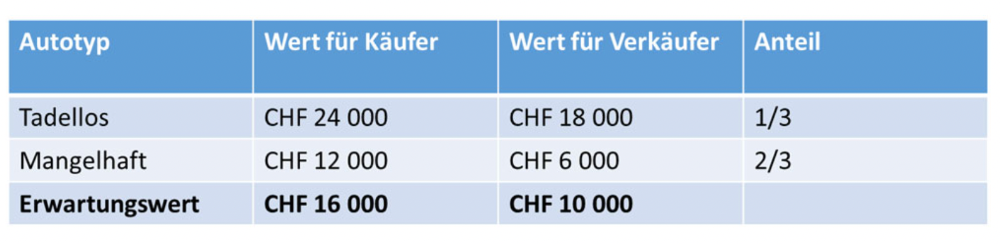
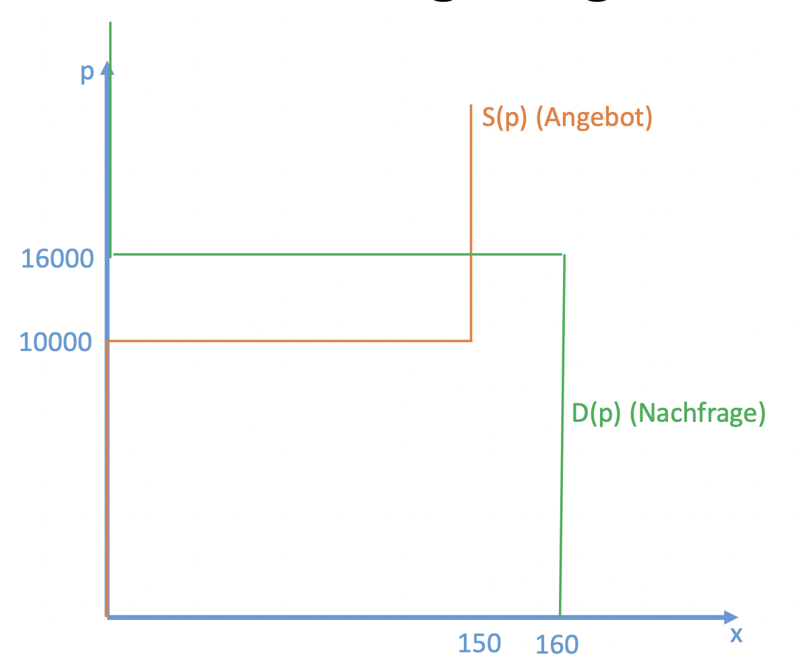
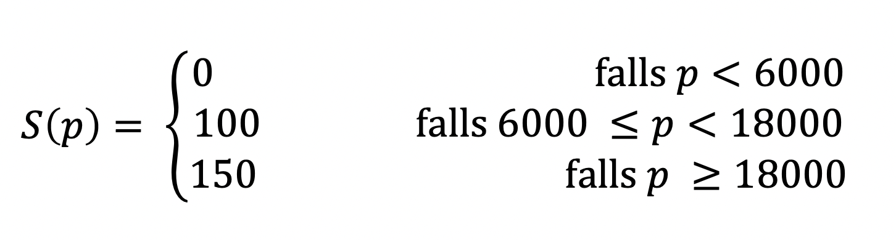
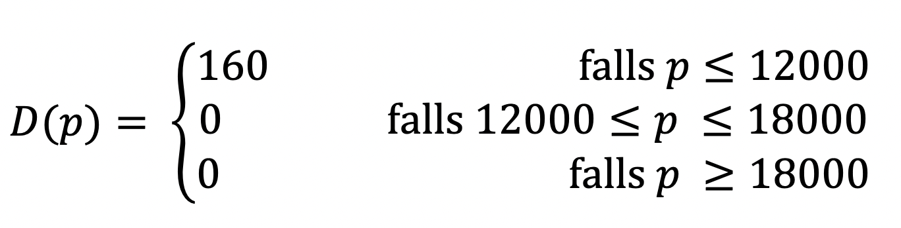
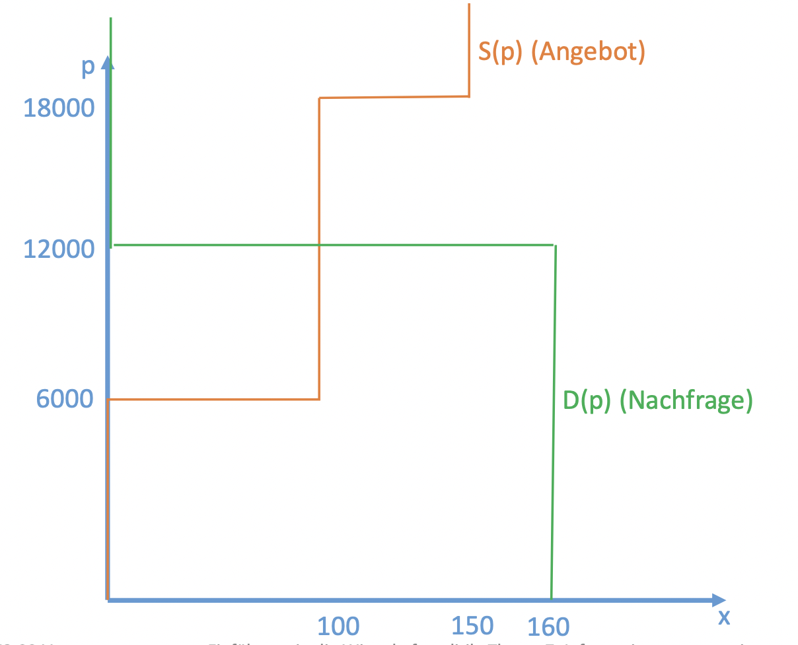
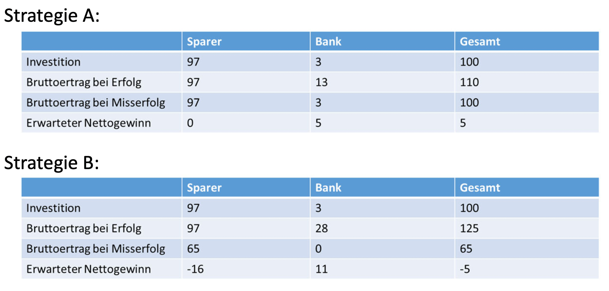

# Erster Hauptsatz und Information

Gültigkeit des ersten Hauptsatzes des Wohlfahrtsökonomik setzt voraus:

- Vollständige Information aller Wirtschaftsakteure bzw.
- Symmetrische Information aller Entscheidungsträger bei Vorliegen von Unsicherheit

Unvollständige bzw. asymmetrische Information kann zur Ungültigkeit des ersten Hauptsatzes führen:

- Vollkommener Wettbewerbsmarkt führt nicht notwendig zu pareto‐ effizienter Allokation. Marktversagen!
- **Mögliche Rolle für Staatseingriffe!**

# Informationsasymmetrie

## Definition

Ein oder mehrere Wirtschaftsakteure sind in Entscheidungssituationen, in denen die Entscheidungen den Nutzen aller Wirtschaftsakteure beeinflussen, besser informiert als ein oder mehrere andere Wirtschaftsakteure.

Zwei Arten:

- Adverse Selektion («Adverse Selection»)
  - Informationsasymmetrie besteht schon zu Beginn der Interaktion (bei Vertragsabschluss). («Hidden Characteristics»)
- Moralisches Risiko («Moral Hazard»)
  - Bei Start der Interaktion (bei Vertragsabschluss) besteht zwischen den beteiligten Akteuren symmetrische Information. Informationsasymmetrie entsteht im Lauf der Interaktion. («Hidden Action»)

# The market of Lemons

- 150 Gebrauchtwagenverkäufer, die jeweils 1 Auto zum Verkauf anbieten
  - 50 Autos sind in tadellosem Zustand.
  - 100 Autos sind mangelhaft («Lemons»).
- 160 potentielle Käufer

## Pareto Effiziente Lösung

- Jedem Käufer ist sowohl ein tadelloses Auto als auch ein mangelhaftes Auto mehr wert als jedem Verkäufer.
- **Pareto‐Effizienz verlangt, dass alle Autos verkauft werden**
  - Effiziente Allokation ist dann erreicht, wenn die Autos bei denjenigen sind, die den höchsten Nutzen davon haben (dies sind gemäss der Nutzentabelle die Käufer).

## Szenario 1: Vollständige Information

Alle Käufer und Verkäufer können die Qualität der Autos (tadellos oder mangelhaft) vor einem potentiellen Kauf beobachten.

- Wettbewerbsmarktergebnis (Überbietungswettbewerb durch die Käufer): - Alle tadellosen Autos werden zum Preis von CHF 24 000 verkauft. - Alle mangelhaften Autos werden zum Preis von CHF 12 000 verkauft.
  **Wettbewerbsmarktergebnis ist pareto‐effizient.**

## Szenario 2: Unvollständige, symmetrische Information

Weder die Käufer noch die Verkäufer kennen vor einem potentiellen Kauf die Qualität der Autos, sie kennen jedoch den Anteil der mangelhaften Autos(2/3). Alle Käufer und Verkäufer sind risikoneutral (Maximierung des erwarteten Gewinns).

Gleichgewicht: Alle Autos werden zum Preis von CHF 16 000 (= Erwartungswert der Käufer) verkauft.

**Wettbewerbsmarktergebnis ist pareto‐effizient.**

**Acthung:**

- Einige Käufer haben CHF 16 000 für ein mangelhaftes Auto bezahlt, obwohl sie dem Auto nur einen Wert von CHF 12 000 beimessen.
- Einige Verkäufer haben ihr Auto zum Preis von CHF 16 000 verkauft, obwohl sie ihm einen Wert von CHF 18 000 beimessen.
- Die Pareto‐Effizienz des Marktergebnisses wird hierdurch nicht tangiert.

## Szenario 3: Asymmetrische Information

Die Verkäufer kennen die Qualität ihrer Autos.
Käufer können die Qualität der Autos vor einem potentiellen Kauf nicht beobachten. Erst bei Gebrauch nach dem Kauf stellt sich heraus, ob das Auto tadellos oder mangelhaft ist.
Die Käufer kennen allerdings den Anteil der mangelhaften Autos (2/3) und kennen die oben dargestellte Nutzentabelle. Alle Käufer und Verkäufer sind risikoneutral (Maximierung des erwarteten Gewinns).

### Aggregierte Angebotsfuktion

### Aggregierte Nachfragefunction

- Käufer können aus dem Verkaufspreis eines Autos einen Rückschluss auf seine Qualität ziehen.
  - Sie wissen, dass nur mangelhafte Autos angeboten werden, solange der Preis zwischen CHF 6 000 und CHF 18 000 liegt.
  - Sie wissen, dass die guten Autos erst ab einem Marktpreis von CHF 18 000 angeboten werden.
    - In diesem Fall ist die Zahlungsbereitschaft der Käufer allerdings nur CHF 16 000 (= erwarteter Gewinn), da sie nicht wissen, ob es sich bei einem Objekt um ein tadelloses oder mangelhaftes Auto handelt.

**Gleichgewichtspreis ist 12'000**

-> Nur die mangelhaften Autos werden verkauft: die Verkäufer bleiben auf den tadellosen Autos sitzen («adverse Selektion»)!

**Wettbewerbsmarktergebnis ist pareto‐ineffizient.**

Die tadellosen Autos wechseln nicht den Besitzer, obwohl sie den Käufern mehr wert sind als den Verkäufern.

**Erster Hauptsatz ungültig: Marktversagen**

**Die Ineffizienz ist weder in der Heterogenität der Güter, noch in der unvollständigen
Information, sondern in der Asymmetrie der Information begründet!**

# Besipiele für adverse Selektion

## Versicherungsmärkte, Arbeitsmarkt, Kreditmarkt

- Krankenversicherung: Für Versicherung unbeobachtbare Gesundheitscharakteristika von Versicherungsnachfragern. Der Versicherungsnachfrager kennt seinen Gesundheitszustand besser als Versicherung.
- Autohaftpflichtversicherung: Versicherung weiss nicht, ein wie sicherer Autofahrer der Versicherungsnachfrager ist. Der Versicherungsnachfrager weiss es besser.
- Arbeitsmarkt: Für Arbeitgeber unbeobachtbare Qualität von Jobkandidaten. Der Jobkandidat kennt seine Qualifikation besser.
- Kreditmarkt: Kreditgeber (Bank) kennt die Erfolgsaussichten einer Investition nicht so gut wie der Kreditnachfrager (Unternehmen).

# Lösungen für adverse Selektion und Rolle des Staats

## Private Lösungen

- Signaling
- Screening
- Screening via sorting

## Rolle des Staates

Massnahmen zur Reduktion von Informationsasymmetrien (Unterstützung von Signaling und Srceening u.a.)

- Gesetzliche Offenlegungspflichten (Anlagemarkt u.a.)
- Staatlich bestätigte Zertifikate (Arbeitsmarkt u.a.)
- Betrieb bzw. Förderung unabhängiger Prüfinstanzen

Theoretisch ist nicht ganz klar, warum der Staat bei Massnahmen zur Reduktion von Informationsasymmetrien beteiligt sein muss (sofern nicht weitere Gründe für Marktversagen vorliegen wie z. B. hohe Kosten von Signaling/Screening. Ein Argument für Beteiligung des Staates könnte sein: Wirtschaftsakteure vertrauen – in zumindest manchen Staaten – einem Signaling bzw. Screening unter Beteiligung des Staats mehr, als wenn der Staat nicht beteiligt ist.

- Staatliche Zwangslösungen zur Steigerung der Wohlfahrt bzw. der Effizienz:
  - Beispiel Krankenversicherung: Versicherungszwang löst Problem, dass nur Personen mit hohem Risiko versichert werden (vgl. hierzu die Analyse zum Gebrauchtwagenmarkt).
  - **Steigerung der Gesamtwohlfahrt bzw. Herstellung einer pareto‐effizienten Lösung**
  - **Achtung: Zwangslösung impliziert Umverteilung: Manche Wirtschaftsakteure müssen sich zu einem Preis versichern, zu dem sich die Versicherung für sie nicht lohnt**
  - **Zwangslösung stellt keine Pareto‐Verbesserung im Vergleich zur Nicht‐ Versicherungs‐Lösung dar.**

# Moralisches Risiko

## Definition

Der Begriff kommt aus der Versicherungswirtschaft ("moral hazard")

"Objektives Risiko": Unvermeidbares Risikos eines Schadens (Blitzschlag etc.)

"Moralisches Risiko": Derjenige Teil des Risikos, bei dem die Eintrittswahrscheinlichkeit oder die Schadenshöhe durch den Versicherten beeinflusst werden kann.

## Prinzipal und Agent

- Der Agent (z. B. der Versicherte) trifft bestimmte Entscheidungen, die sowohl seinen eigenen Nutzen als auch den des Prinzipals beeinflussen.
- Der Prinzipal (z. B. die Versicherung) kann die Entscheidungen nicht selbst treffen, sondern nur versuchen, die Entscheidungen des Agenten durch «Anreizmechanismen» zu beeinflussen.

## Ursachen des moralischen Risikos bei «Prinzipal‐ Agenten»‐Beziehungen

- Informationsasymmetrie: Der Agent hat mehr Informationen als der Prinzipal. Z. B. kann der Prinzipal das Verhalten des Agenten nicht (perfekt) beobachten.
- Interessensgegensatz: Agent und Prinzipal haben unterschiedliche Interessen (siehe Beispiele unten).

## Beispiele Moralisches Risiko

- Kranken‐ bzw. Unfallversicherung: Versicherter kann mehr oder weniger gesund leben bzw. mehr oder weniger Risiken eingehen.
- Autohaftpflichtversicherung: Versicherter kann vorsichtig oder weniger vorsichtig fahren.

  - Studien zeigen:
    - Anzahl der Unfälle bei Leihwagen ist höher, wenn diese vollkaskoversichert sind. (Hier liegt wahrscheinlich sowohl moralisches Risiko als auch adverse Selektion vor.)
    - Autohalter mit besonders sicheren Autos fahren gefährlicher.

- Arbeitgeber – Arbeitnehmer
  - Angestellter kann sich im Job mehr oder weniger bemühen bzw. kann mehr oder weniger «hart arbeiten».
  - Studien zeigen:
    - Krankenstand hängt ab von der Höhe der Lohnfortzahlung im Krankheitsfall. Signifikanter Rückgang des Krankenstands bei nur teilweiser Lohnfortzahlung.

## Effiziente Risikoallokation

Für eine effiziente Risikoallokation gilt das folgende Prinzip: Soll ein Risiko zwischen mehreren Parteien aufgeteilt werden und ist eine dieser Parteien risikoneutral, die anderen Parteien aber risikoavers, so ist die effiziente Risikoallokation dann erreicht, wenn das gesamte Risiko von der risikoneutralen Partei getragen wird.
**Begründung:** Der risikoneutralen Partei entstehen durch die Risikoübernahme keine Kosten, den risikoaversen Parteien entstehen dagegen Kosten (in Höhe einer sogenannten Risikoprämie).

Versicherungen sind zumindest annähernd risikoneutral (Pooling von vielen Risiken); Versicherte sind dagegen i.d.R. risikoavers.

## Lösung bei vollkommener Information

- Vollständige Versicherung.
- Versicherter zahlt Preis an Versicherung für Versicherungsübernahme
- **maximale Zahlungsbereitschaft: Risikoprämie**

## Lösung bei asymmetrischer Information

Nur teilweise bzw. Extremfall gar keine Versicherung
Intuitive Begründung:

- Ein Versicherter hat einen relativ geringen bzw. im Extremfall keinen Anreiz, «moralisches Risiko»‐Verhalten zu unterlassen, da dies zum Teil bzw. ausschliesslich der Versicherung nutzt.
- Die Versicherungen sehen das voraus, sie gehen davon aus, dass wegen moralischem Risiko ein Schadensfall mit relativ hoher Wahrscheinlichkeit eintritt und verlangen entsprechend einen relativ hohen Preis für die Versicherungsleistung.
- Der Preis ist so hoch, dass sich eine (vollständige) Versicherung nicht lohnt.

## Pareto‐Ineffizienz und Marktversagen

Nicht‐Versicherung (oder nur teilweise Versicherung) stellt eine pareto‐ ineffiziente Lösung dar.
**Erster Hauptsatz ungültig** 
**Wettbewerbsmarkt versagt hinsichtlich der Erzielung eines pareto‐effizienten Ergebnisses!**

**Achtung: Die Nicht‐Versicherung geht zu Lasten der Versicherungswilligen.**
Sie müssen das Schadensrisiko tragen, obwohl sie das
nicht wünschen.

# Lösungen für moralisches Risiko und Rolle des Staats

## Private Lösungen

- Überwachung und Ausschlussklauseln!?
- Selbstbeteiligung bzw. Selbstbehalt!?
  - Versicherter zahlt einen Teil des Schadens selbst.
  - Im Extremfall zahlt Versicherter den ganzen Schaden (100% Selbstbetei‐ ligung).
  - **Das Problem des moralischen Risikos ist gelöst, aber die Lösung ist pareto‐ineffizient.**
  - Existenz von Selbstbehalten z. B. bei Autounfallversicherungen oder Krankenversicherungen stellen keine pareto‐effiziente Lösung dar!

# Moralisches Risiko am Finanzmarkt

## Historische Vorlagen

- «Savings‐and‐Loan»‐Krise USA 1980er Jahre
- Immobilien‐ und Bankenkrise Schweden Anfang 1990er Jahre
- Finanzkrise Japan ab Anfang 1990er Jahre
- Weltweite Finanzkrise ab 2007 (ausgelöst durch US‐Immobilienkrise)

## Risikowahl

Bank kann zwischen 2 strategien wählen:

- Strategie A:
  - Einsatz des Bankkapitals von (CHF) 100 (Mio.) für relativ sichere Kredite bzw. Anlagen.
  - Rückzahlung 100 oder 110 jeweils mit Wahrscheinlichkeit 0.5
  - **Erwarteter Gewinn 5**
- Strategie B:
  - Einsatz des Bankkapitals von (CHF) 100 (Mio.) für relativ risikoreiche Anlagen.
  - Rückzahlung 65 oder 125 jeweils mit Wahrscheinlichkeit 0.5
  - **Erwarteter Gewinn: ‐5**

B ist eindeutig schlechter als A (niedriger erwarteter Gewinn und höheres Risiko)

Bank finanziert ihre Investitionen (Kredite bzw. Anlageprodukte) aus zwei Quellen: Spareinlagen und Eigenkapital
Mindesteigenkapitalquote = 3%
Zinssatz für Spareinlagen auf 0 normiert

Bank wählt Strategie B: 
Erwarteter Nettogewinn der Sparer: 0.5 _ 0 + 0.5 _ (65 – 97) < 0 
Erwarteter Nettogewinn der Bank: 0.5 _ (28‐3) + 0.5 _ (0 – 3) = 11

## Anreiz zu riskanten Analgen
- Die (gesamtwirtschaftlich klar schlechtere) Strategie B ist für die Bank profitabler als Strategie A!
    - Wenn die Strategie erfolgreich ist, streicht die Bank den ganzen Gewinn ein.
    - Wenn die Strategie scheitert, werden die Verluste vom Sparer getragen.
- Je höher das Risiko desto besser für die Bank!
- **Bank hat starken Anreiz, in risikoreiche Projekte bzw. Anlagen zu
investieren.**

##  Das Problem von Bailoutgarantien
- Explizite oder implizite Bailoutgarantien durch den Staat bzw. Einlageversicherungen erweitern das Problem des moralischen Risikos.
- Den Sparern ist die Investitionsentscheidung der Bank egal, da ihre Verluste im Schadensfall kompensiert werden
- Kein Anreiz zur Kontrolle der Bank. Auch stark risikoorientierte Banken haben keine Probleme, sich hinreichend Kapital zu beschaffen.
- Vergemeinschaftung von Verlusten aus riskantem Anlageverhalten von Privaten. Gewinne bleiben dagegen bei den Privaten.

## Perverser Effekt des Wettbewerbs
- Diejenigen Banken, die in riskante Projekte bzw. Anlagen investieren und damit Erfolg haben, können höhere Zinsen für Spareinlagen zahlen als solche, die in sichere Anlagen investieren.
- Sparer bevorzugen Banken mit höheren Zinsen, da/wenn die Verlustrisiken durch den Staat getragen werden (Bailout).
- «Vorsichtige» Banken werden aus dem Markt verdrängt bzw. sind selbst zu riskantem Anlageverhalten gezwungen.

## Relevanz von Eigenkapitalquoten
- Durch höhere Eigenkapitalquoten wird das Problem des moralischen Risikos reduziert.
- Vgl. oberes Beispiel: Bei Eigenkapitalquote von 100% ist Strategie A für Bank attraktiver als Strategie B.