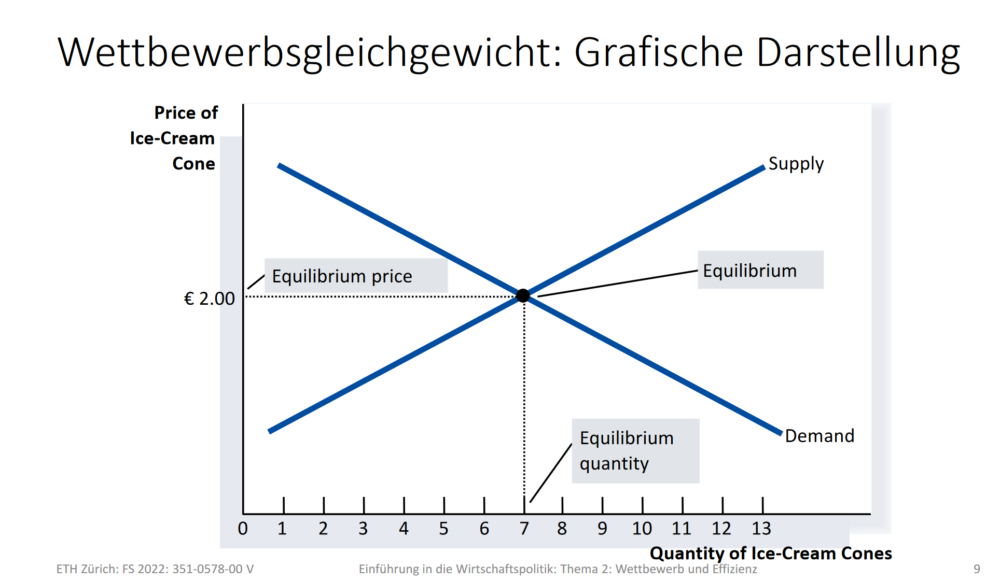
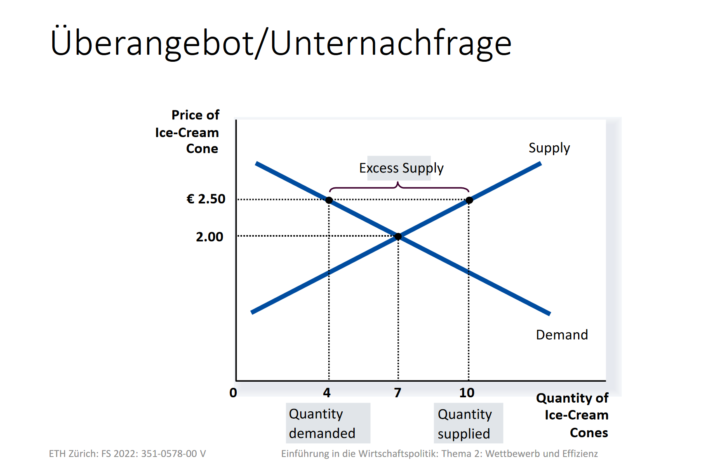
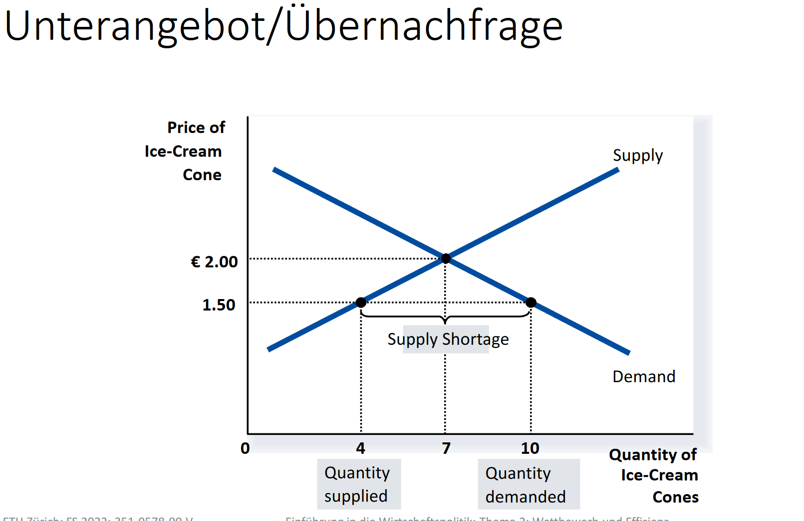

# Definitionen Wettbewerb und Gleichgewicht

## Definition vollkommene Konkurrenz bzw. vollkommener Wettbewerb
Definitionsmerkmale eines Marktes mit vollkommener Konkurrenz:
- Keinerlei Marktmacht: Einzelne Anbieter oder Nachfrager können Marktpreise nicht beeinflussen; reine Mengenanpassung an jeweilige Marktpreise
- Keine Transaktionskosten
    - freier zugang zum markt
    - kostenlose Mobilität von Gütern
    - Unbegrenzte teilbarkeit von Gütern

## Definition allgemeines (Wettbewerbs‐)Gleichgewicht
Gütermengen und Preise sind so gewählt/stellen sich so ein, dass
folgende Bedingungen erfüllt sind:
- Alle Konsumenten erreichen ihr Nutzenmaximum gegeben ihre Budgetbeschränkung
- Alle Produzenten erreichen ihr Nutzenmaximum gegeben ihre Produktionsfunktio
- Alle Märkte sind **geräumt** (Nachfrage = Angebot)

$$
D_m = S_m \text{ auf allen Märkten } m=1,...,M
$$
$D_i$ - Demand on market $i$  
$S_i$ - Supply on market $i$

# Erster Hauptsatz der Wohlfahrtsökonomik
Jedes allgemeine Wettbewerbsgleichgewicht ist
unter bestimmten Voraussetzungen pareto‐effizient