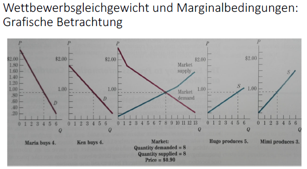
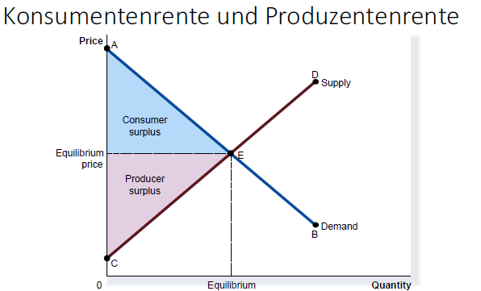

# Definitionen Wettbewerb und Gleichgewicht

## Definition vollkommene Konkurrenz bzw. vollkommener Wettbewerb
Definitionsmerkmale eines Marktes mit vollkommener Konkurrenz:
- Keinerlei Marktmacht: Einzelne Anbieter oder Nachfrager können Marktpreise nicht beeinflussen; reine Mengenanpassung an jeweilige Marktpreise
- Keine Transaktionskosten
    - freier Zugang zum Markt
    - kostenlose Mobilität von Gütern
    - Unbegrenzte teilbarkeit von Gütern

## Definition allgemeines (Wettbewerbs‐)Gleichgewicht
Gütermengen und Preise sind so gewählt/stellen sich so ein, dass
folgende Bedingungen erfüllt sind:
- Alle Konsumenten erreichen ihr Nutzenmaximum gegeben ihre Budgetbeschränkung
- Alle Produzenten erreichen ihr Nutzenmaximum gegeben ihre Produktionsfunktio
- Alle Märkte sind **geräumt** (Nachfrage = Angebot)

$$
D_m = S_m \text{ auf allen Märkten } m=1,...,M
$$
$D_i$ - Demand on market $i$  
$S_i$ - Supply on market $i$

# Erster Hauptsatz der Wohlfahrtsökonomik
Jedes allgemeine Wettbewerbsgleichgewicht ist
unter bestimmten Voraussetzungen pareto‐effizient

- Über das zustande kommen eines Gleichgewichtes trift der erste Hauptsatz keine Aussage 

Angenommen das vollkommenen Wettbewerb geprägte Märkte immer zu einem allgemeinen Wettbewerbsgleichgewicht tendieren
So folgt aus dem ersten Hauptsatz:
- Durch vollkommenen Wettbewerb geprägte Märkte erzeugen pareto‐effiziente Zustände.
    - Alle verfügbaren resscourcen werden optimal genutzt [vgl. Thema 1](ETH.EWP.Wohlfahrt.md#Pareto-Optimalitaet)
- Die individuellen, nicht zentral koordinierten – auf Optimierung ihres eigenen Nutzens gerichteten – Handlungen der Markakteure erzeugen effiziente Zustände. Es braucht keinen zentralen Planer zur Herstellung von Effizienz.

Hypothese: Ein Wettbewerbsmarkt kann Effizienz sogar besser herstellen als ein
zentraler Planer

**Vorsicht**: Damit diese optima erreicht wereden müssen viele (unrealistische) Annahmen getroffen werden

# Marginalbedingungen
Perspektiven:
- Oben: Erster Hauptsatz «statuiert», dass Wettbewerbsmarktgleichgewichte unter bestimmten Voraussetzungen (pareto‐)effiziente Ergebnisse liefern.
- Nun: Betrachtung der (Pareto‐)Effizienz von Wettbewerbsmarktgleichgewichten aus alternativer Perspektive.

## Die drei Marginalbedingungen für Effizienz
1. Marginaler Nutzen aller Konsumenten/Nachfrager ist gleich
$$
\forall i \in \{1,...,I \} \frac{\partial U}{\partial Q} = \frac{\partial U_i}{\partial Q_i}
$$
2. Marginal Kosten aller Produzenten/Anbieter ist gleich 
$$
\forall j \in \{1,...,J \} \frac{\partial C}{\partial Q} = \frac{\partial C_j}{\partial Q_j}
$$
3. Marginal Nutzen aller Konsumenten entspricht marginal Kosten aller Produzenten
$$
\forall j, i \; \frac{\partial U_i}{\partial Q_i} = \frac{\partial C_j}{\partial Q_j}
$$

## Gültigkeit der Marginalbedingungen
### 1
- Für jede position (p) der individuellen Nachfragekurve gilt:
$$
\frac{\partial U_i}{\partial Q_i} = p
$$

- Im Marktgleichgewicht mit Gleichgewichtspreis $p*$ gilt:
 $$
\frac{\partial U_1}{\partial Q_1} = ... = \frac{\partial U_I}{\partial Q_I} = p*
$$

### 2
- Für jede position (p) der individuellen Nachfragekurve gilt:
$$
\frac{\partial C_j}{\partial Q_j} = p
$$

- Im Marktgleichgewicht mit Gleichgewichtspreis $p*$ gilt:
$$
\frac{\partial C_1}{\partial Q_1} = ... = \frac{\partial C_J}{\partial Q_J} = p*
$$

### 3
- Aus den oberen Gleichungen ergibt sich, dass im Marktgleichgewicht gilt:
$$
\forall j, i \; \frac{\partial U_i}{\partial Q_i} = \frac{\partial C_j}{\partial Q_j} = p* 
$$

### Gradfische-Darstellung

## Voraussetzungen
- Präferenzen (Nutzenfunktionen) stetig und monoton (mehr ist besser)
- Produktionsfunktionen stetig
- Keine Externalitäten, d. h. u. a.
    - Präferenzen nur von eigenem Güterbündel abhängig
    - Produktionsfunktionen nur von eigenen Inputs abhängig
- Vollständige Information aller Marktakteure

Grundlegende Voraussetzungen
- Vollständiger Wettbewerb (vgl. [[ETH.EWP.Wettbewerb_Effizienz#definition-vollkommene-konkurrenz-bzw-vollkommener-wettbewerb]])
- Keine Grössenvorteile bzw. keine zunehmenden Skalenerträge
- Keine Transaktionskosten (vgl. [[ETH.EWP.Wettbewerb_Effizienz#definition-vollkommene-konkurrenz-bzw-vollkommener-wettbewerb]])
- Vollständige Rationalität der Marktakteure

# Wettbewerb und utilitaristische Wohlfahrtsfunktion
Im Wettbewerbsmarktgleichgewicht wird die soziale Wohlfahrt bzw.
der 'soziale Überschuss' gemäss der utilitaristischen Wohlfahrtsfunktion
maximiert.
Der soziale Überschuss setzt sich zusammen aus Konsumentenrente
und Produzentenrente.

# Zweiter Hauptsatz der Wohlfahrtsökonomik
Unter bestimmten Voraussetzungen können Märkte
mit vollkommenem Wettbewerb bei geeigneter Wahl
der Anfangsausstattungen bzw. von Kopfsteuern jede
gewünschte pareto‐effiziente Allokation erzielen

## Wettbewerb und Gerechtigkeit
- Erster Hauptsatz statuiert Effizienz von Wettbewerbsmärkten
- Aber: Erster Hauptsatz sagt nichts über Gerechtigkeit
- Wettbewerbsmarktergebnisse sind nicht notwendigerweise auch 'gerecht'
- M.a.W. sofern das gewählte normative Wohlfahrtskriterium nicht dasjenige der Pareto‐Optimalität ist (vgl. [[Wohlfahrtsökonomik und Werturteile| ETH.EWP.Wohlfahrt#soziale-wohlfahrtsfunktion]]) sind Wettbewerbsmarktergebnisse in normativer Hinsicht nicht notwendigerweise optimal.

## Anfangsausstattung
- Grosse Menge von Wettbewerbsmarktgleichgewichten
- Welches konkrete Gleichgewicht – und damit welche konkrete paretoeffiziente Allokation – sich einstellt, hängt von der Anfangsausstattung der Marktakteure ab.

## Voraussetzungen
- Alle Voraussetzungen für die Gültigkeit des ersten Hauptsatzes
- Kopfsteuern ohne Transaktionskosten einführbar
- Konvexe Präferenzen
- Konkave Produktionsfunktionen

# [Kontrollfragen](slides/Thema2_WettbewerbUndEffizienz.pdf)