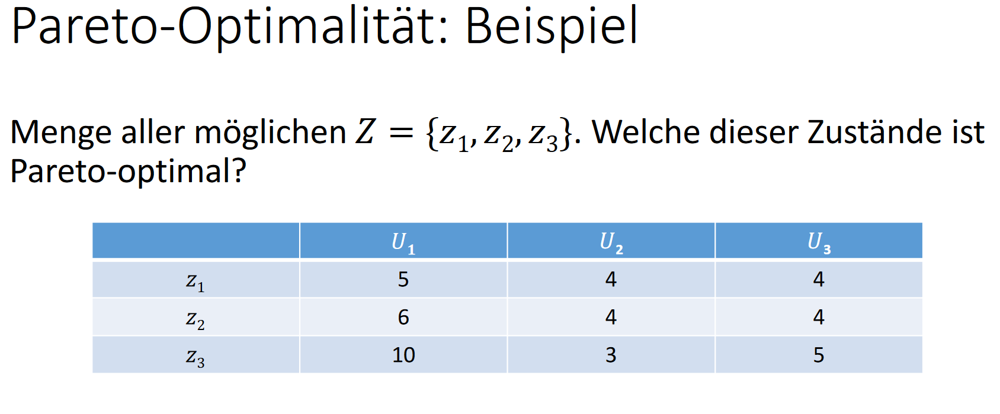
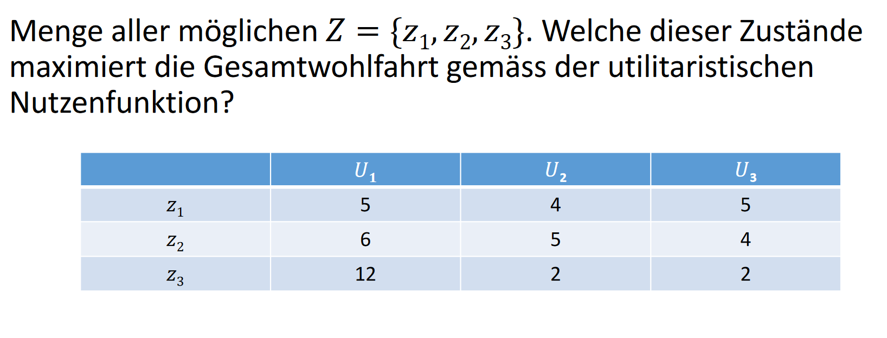

# Definition
Wohlfahrtsökonomik: Teilbereich der volkswirtschaftlichen Forschung,
der mit Nutzen (Wohlfahrt) auf gesamtgesellschaftlicher Ebene
beschäftigt

- Grundlage der Wirtschaftspolitik

# Angebot und Nachfrage

Aggregierte Angebotskurve: Summe aller individuellen
Angebotsmengen für ein Gut (hier Eiscreme) in Abhängigkeit vom
Preis: $S(p)$

Aggregierte Nachfragekurve: Summe aller individuellen Nachfragen
nach einem Gut (hier Eiscreme) in Abhängigkeit vom Preis: $D(p)$

# Soziale Wohlfahrtsfunktion
Seien $z_i \in Z$ alle möglichen Alternativen Zustände $Z = \{z_1, ..., z_N\}$

Die Nutzenfunktion (Utilityfunction) von einem Individuum ($i \in \{1,...,l\}$) $U_i$ ordnet jeden Zustand/Alternative ein Nutzwert (Reelezahl) zu: $U_i(z_k) = n$

Die Soziale Wohlfahrtsfunktion ($W(U_1, ..., U_l)$) aggregiert individuelle nutzen.

## Pareto-Optimalitaet

### Definition
Pareto-Optimal:
Ein ökonomischer Zustand ist Pareto‐optimal (Pareto‐effizient), wenn
es nicht möglich ist, ein Individuum besser zu stellen ohne gleichzeitig
ein anderes Individuum schlechter zu stellen.

(Nur $z_1$ ist nicht Pareto optimal)

### Als normatives Kriterium 
Gemäss Pareto‐Optimalität als normativen Kriterium ist eine wirt‐
schaftspolitische Massnahme nur dann gerechtfertigt, wenn sie –
relativ zur Ausgangslage – eine Pareto‐Verbesserung erzeugt. 

- Hat 'Bias' zum Status Quo (gerechtfertigt?)
- Nur ordinale Nutzenmessung notwendig (im Gegensatz zu Ansätzen basierend auf Aggregatsfunktionen.
- Individuen mussen ihre eigen Werte in konsistenten Reihenfolge bringen (oft nicht möglich)
## Wohlfahrtsfunktion und Werteurteile
- verschiedene normative Grundeinstellungen -> verschiedene Massstäbe
- Wahl eines Massstabs impliziert Werteurteil

## Utilitaristische Wohlfahrtsfunktion
$$
W_U(U_1, ..., U_l)= \sum_{i=1}^{l}U_i
$$

Diese Funktion bildet den gesamtgesellschaftlichen Nutzen ab  
Oft verwendet weil simple und summe der Einzel Nutzen maximiert wird

## Rawlsche Wohlfahrtsfunktion
$$
W_R(U_1,...,U_l) = min\{U_1,...,U_l\}
$$

Maximiert den Nutzen des "ärmsten" Individuums

## Kritik
- Normative messung des Nutzen schwierig (schwer bis nicht ermittelbar)
- interpersoneller Vergleich von Nutzen nötig (evtl. nich möglich)
- Ist Präferenz eines Individuums einfach hinzunehmen? (Diese Kritik gilt allgemein für wohlfahrtsökonomische Ansätze)
- Kritik an utilitaristischer Nutzenfunktion: Ist eine wirtschaftspolitische Massnahme gerechtfertigt, wenn dadurch zwar die Mehrheit gewinnt, aber eine (substantielle) Minderheit verliert
- Trotz Problemen mit Utilitaristische Wohlfahrtsfunktion hohe Beliebtheit

$z_3$ ist wohlfahrtsoptimal

# Wahlparadox von Condorcet
Welches dieser Projekte wird gewinnen:

Solution:

Aber: 

Daraus folgt die Präferenzordnung ist uneindeutig d.h.
$$ 
\text{Bildung > Tunnel > Kampfjet > Bildung}
$$